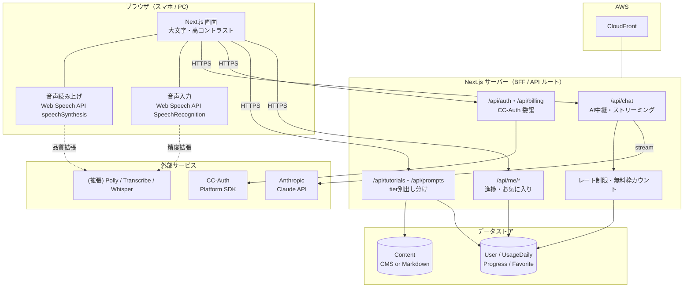
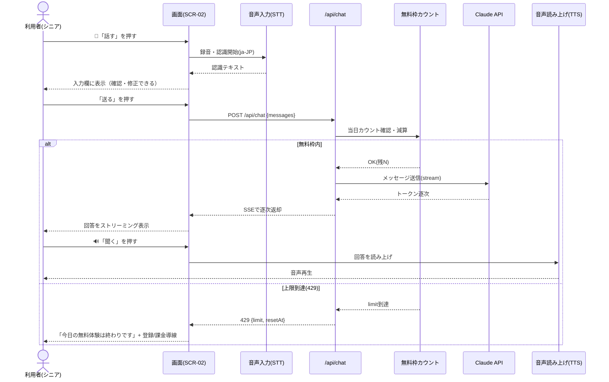
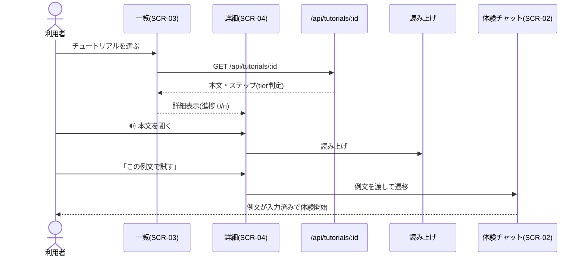
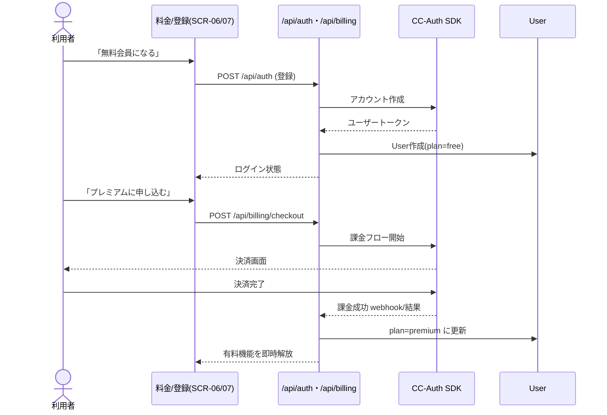
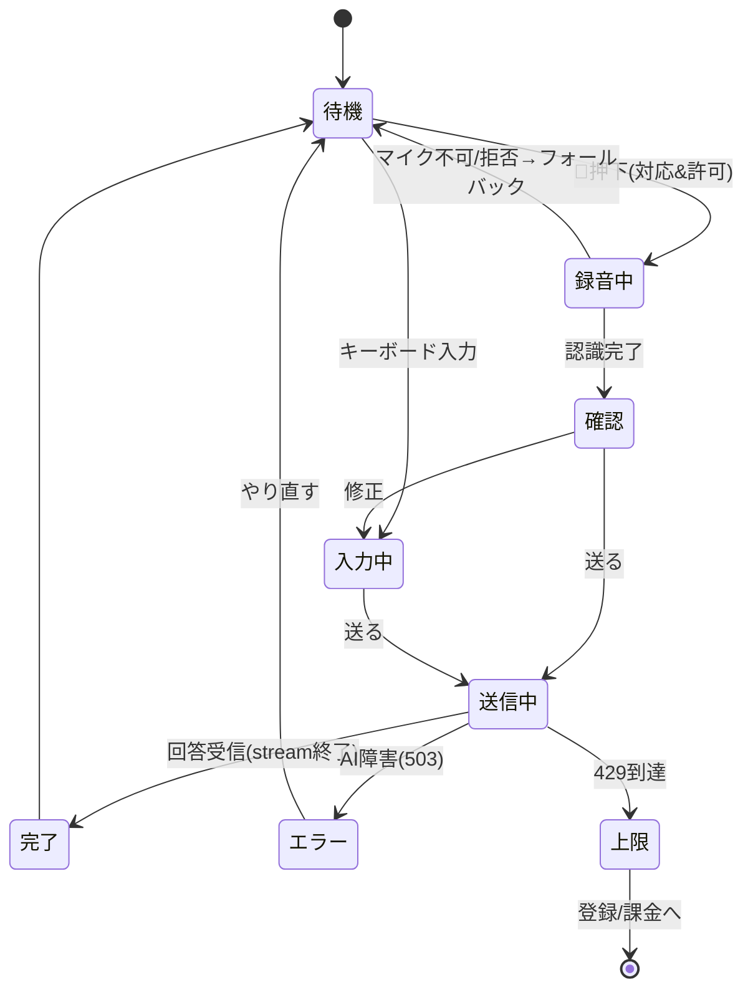

# 図面集（アーキテクチャ／シーケンス） — ４0代からできるAI攻略

| 項目 | 値 |
|------|-----|
| ドキュメント種別 | 設計図面（Phase 2: Design） |
| バージョン | 0.1.0（ドラフト） |
| 作成日 | 2026-06-05 |
| 元ドキュメント | [requirements.md](./requirements.md) / [spec.md](./spec.md) / [design.md](./design.md) |
| 記法 | Mermaid（GitHub等でレンダリング可） |

---

## 1. アーキテクチャ図（コンポーネント）

---

## 2. シーケンス図：声だけで完結するAIチャット（FR-02/03/10/11）

---

## 3. シーケンス図：学んで試す（チュートリアル⇄体験連動 FR-04/05）

---

## 4. シーケンス図：フリーミアム課金（FR-07/08）

---

## 5. 状態遷移：AIチャット入力（音声フォールバック含む）

---

## 6. 次のステップ
1. 図のレビュー・承認
2. Issue起票（Epic＋Phase/Wave分解）→ `/create-issue`
3. Phase 4 実装（Agent経由：Coordinator / CodeGen）

---

*CCAGI SDK — Phase 2: Design (Diagrams) / Standard tier*
